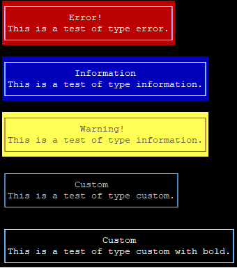

# text-box-console-node
Create a text box in console



Parameters

```js
{
    text: [
        'Array',
        'With Text'
    ],
    align: 'optional, align string, must be: left, right or center',
    type: 'type, must be: custom, error, warning, information or nothing',
    color: 'optional, working with custom or nothing: ex. 1;7'
}
```
